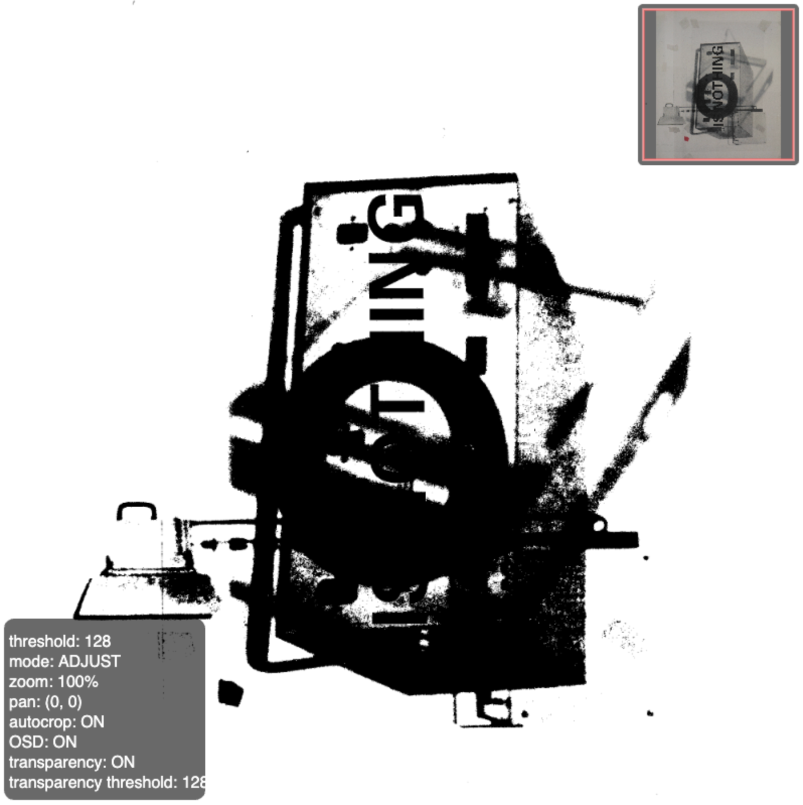
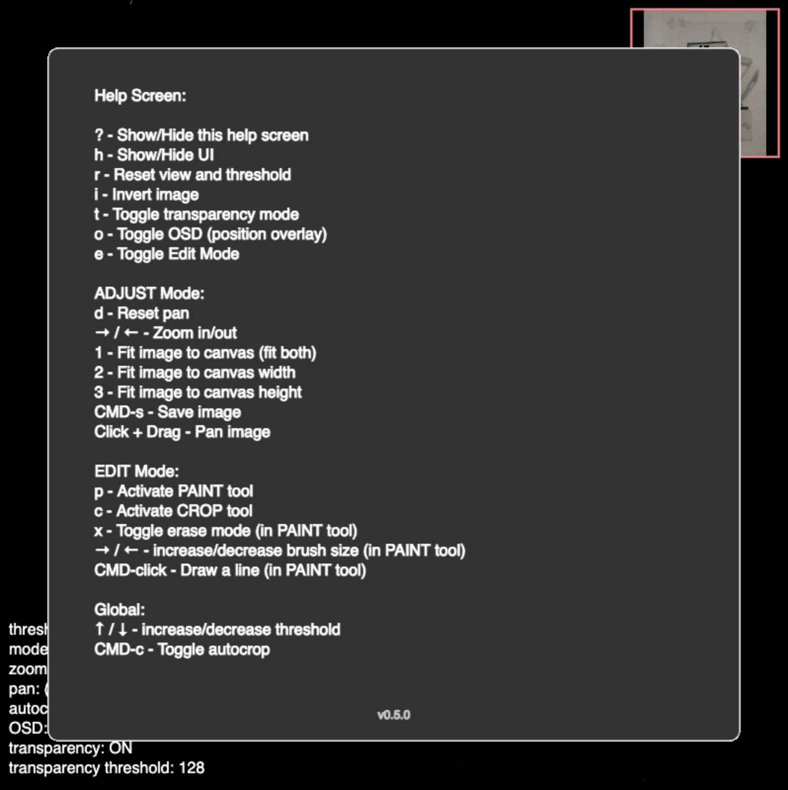

# monochromifier

make square b&w images I use for duo-chrome

> **⚠️ This repository has moved to a monorepo**
>
> Active development now happens in the [GenArt Monorepo](https://github.com/michaelpaulukonis/genart-monorepo).
>
> This repository remains active **only** for GitHub Pages deployment. The source code here is no longer maintained.

---

 Screenshot showing UI

 Screenshot showing help screen

## 🔗 Links

- **Live Demo:** [https://michaelpaulukonis.github.io/monochromifier/](https://michaelpaulukonis.github.io/monochromifier/)
- **Monorepo:** [https://github.com/michaelpaulukonis/genart-monorepo](https://github.com/michaelpaulukonis/genart-monorepo)
- **Source Code:** [apps/monochromifier/](https://github.com/michaelpaulukonis/genart-monorepo/tree/main/apps/monochromifier)
- **Documentation:** [View in monorepo](https://github.com/michaelpaulukonis/genart-monorepo/tree/main/apps/monochromifier/README.md)

## Development

All development happens in the monorepo. To work on this project:

```bash
git clone https://github.com/michaelpaulukonis/genart-monorepo.git
cd genart-monorepo
pnpm install
nx dev monochromifier
```
